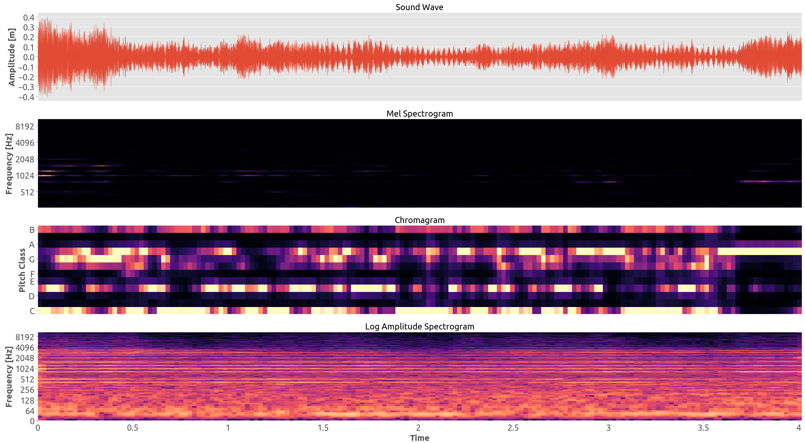
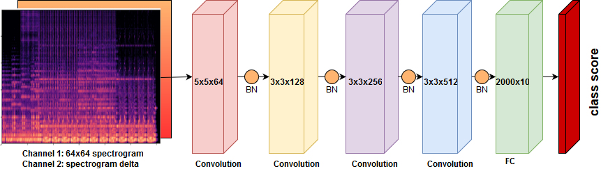
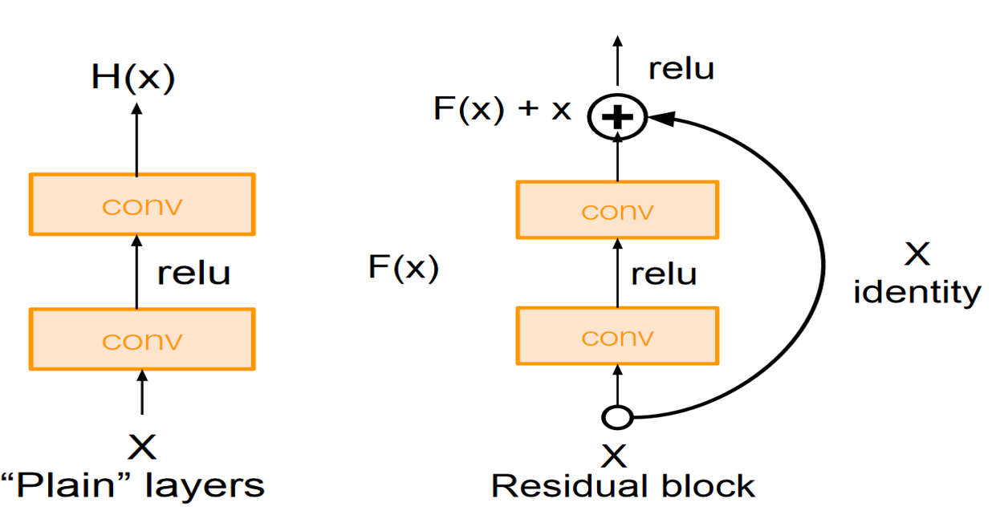
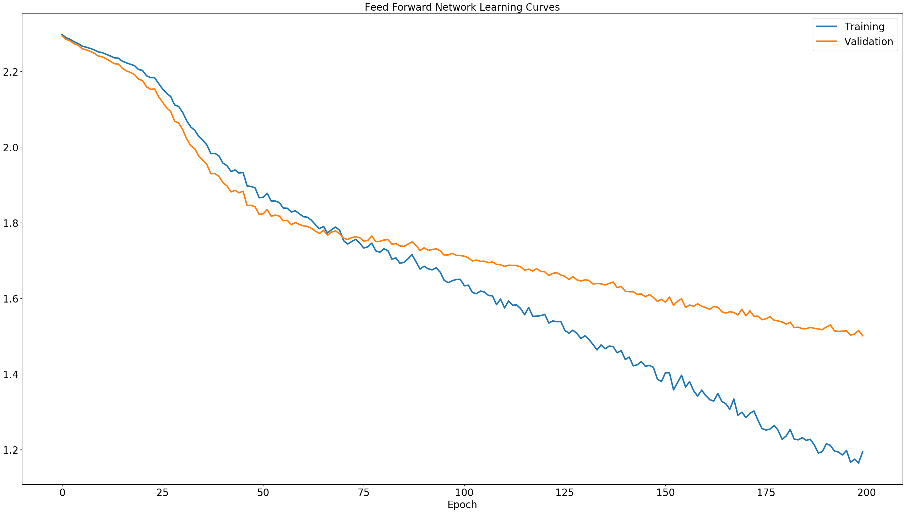
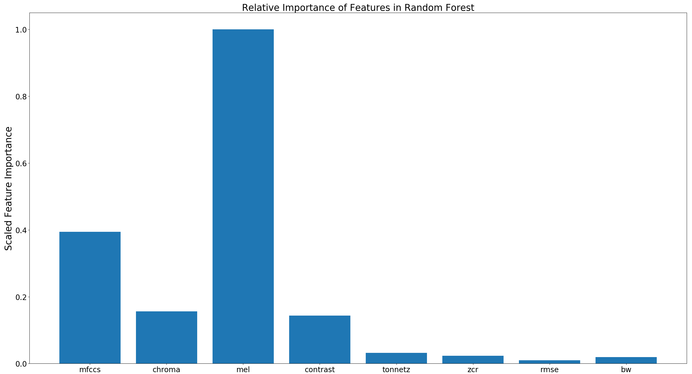
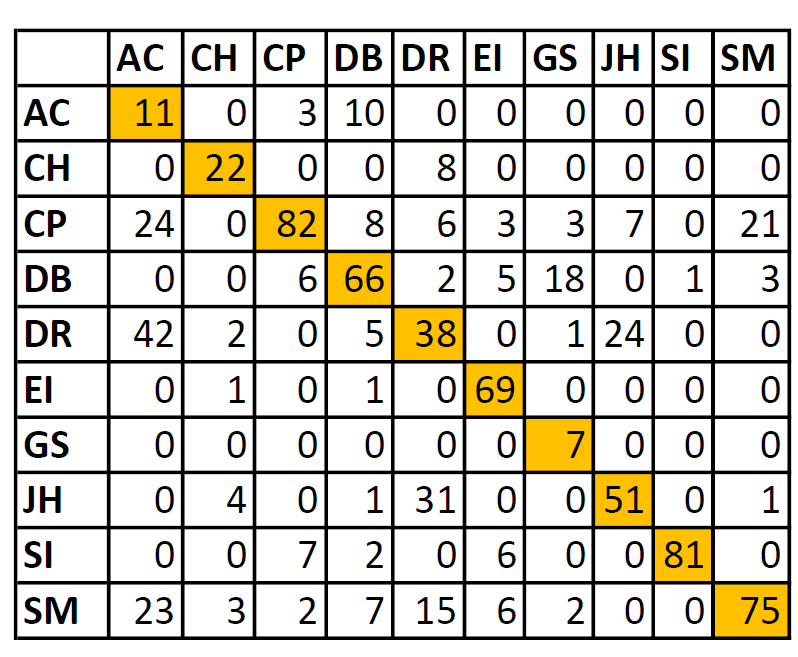
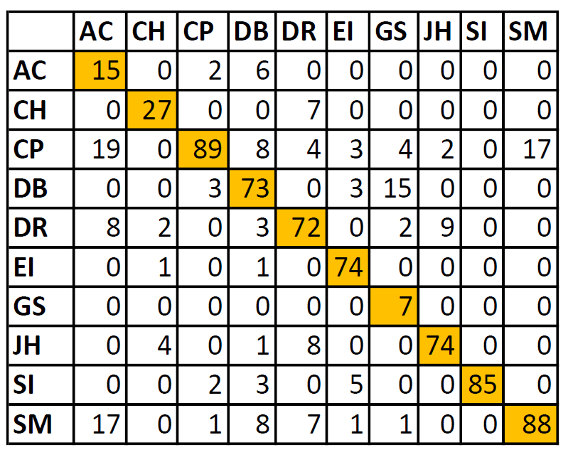

# A Survey of Sound Classification Using Classic Methods and Deep Learning

**CS221: Artificial Intelligence Principles and Techniques, Fall 2017, Stanford University**
Filippo Ranalli (`franalli@stanford.edu`) · Hiroshi Mendoza (`hmendoza@stanford.edu`)

We compare a range of shallow and deep classifiers on the
[UrbanSound8K](https://urbansounddataset.weebly.com/urbansound8k.html) dataset
for environmental and urban sound recognition.

The motivating application is assistive hearing. Roughly 5% of the world's
population suffers from some form of hearing loss, which makes it harder to
identify nearby dangers or meaningful acoustic events. Real-time sound
recognition could close that gap.

## Related Work

Sound classification has a commercial precedent in Shazam, which fingerprints
music against a database. That trick does not generalize to environmental
sounds, since there is no consistent signature across instances of, say, a
dog bark or shattering glass. In the biomedical domain, Rubin et al. (PARC)
converted 1D heart-sound time series into 2D time-frequency representations
and reached high accuracy with a deep network.

For environmental audio specifically, Salamon et al. surveyed shallow
classifiers on UrbanSound, with results later outperformed by deeper models.
Piczak applied a 2-layer CNN to segmented spectrograms and beat
hand-engineered features, though performance was capped by dataset size.
SCAPER (Salamon et al.) added augmented soundscapes and trained an AlexNet
variant on them. The most relevant benchmark is Hershey et al.'s comparison
of FC, AlexNet, VGG, and ResNet on Google's AudioSet, where ResNet topped
the table at 0.926 accuracy. Our choice of ResNet-18 here is motivated by
that result.

## Dataset

[UrbanSound8K](https://urbansounddataset.weebly.com/urbansound8k.html): 8,732
labeled `.wav` clips, each up to 4 seconds, evenly distributed across 10
classes:

| Code | Class             | Code | Class            |
|------|-------------------|------|------------------|
| AC   | air conditioner   | EI   | engine idling    |
| CH   | car horn          | GS   | gunshot          |
| CP   | children playing  | JH   | jackhammer       |
| DB   | dog bark          | SI   | siren            |
| DR   | drilling          | SM   | street music     |

The 10 pre-defined folds are split 80/10/10: folds 1-8 for training, fold 9
for development, fold 10 held out for testing.

## Feature Extraction

Raw waveforms are converted to the time-frequency domain via the Short-Time
Fourier Transform (window size 2048) using [Librosa](https://librosa.org/).
Three feature pipelines are used.

**Time-averaged feature vectors** (`src/features/feature_extraction_means.py`)
feed the shallow classifiers and the feed-forward NN. Each clip is reduced
to a length-193 vector by concatenating the time-averaged values of:

- Mel-scaled spectrogram (`mel`, 128)
- Mel-Frequency Cepstral Coefficients (`mfccs`, 40)
- Chromagram (`chroma`, 12)
- Spectral Contrast (`contrast`, 7)
- Tonal Centroid Features (`tonnetz`, 6)
- Zero Crossing Rate (`zcr`, 1)
- Root-Mean-Square Energy (`rmse`, 1)
- Spectral Bandwidth (`bw`, 1)

PCA reduces this to 185 dimensions where it helps.

**2D spectrograms** (`src/features/feature_extraction_CNN.py`) feed the CNN
and ResNet. Each clip is converted to a 2-channel `[2, 64, 64]` image:
channel 1 is the log-mel spectrogram, channel 2 is its temporal delta.

**Sequential MFCCs** (`src/features/feature_extraction_RNN.py`) feed the RNN.
Each clip is windowed into 100-step sequences of 50-dimensional MFCC vectors.



## Models

| File | Model | Stack |
|------|-------|-------|
| `src/models/kNN.py` | k-Nearest Neighbors | sklearn, L1/Minkowski distance, sweep K = 1...99 |
| `src/models/SVM.py` | Support Vector Machine | sklearn, RBF kernel, one-vs-rest |
| `src/models/randomForest.py` | Random Forest | sklearn, 1000 trees |
| `src/models/NN.py` | 4-layer feed-forward net | PyTorch (CPU) |
| `src/models/CNN.py` | 4-layer CNN | PyTorch (GPU) |
| `src/models/resNet.py` | ResNet-18 | PyTorch (GPU) |
| `src/models/RNN.py` | LSTM | PyTorch (GPU) |

All deep models use Adam (lr = 1e-3, weight decay = 1e-3), cross-entropy
loss, Xavier init, batch normalization, and dropout. The 4-layer NN uses
four affine→BN→ReLU→Dropout blocks of width 200 with dropout p = 0.65. The
baseline CNN is `[Conv→BN→ReLU]×4 → MaxPool → FC` with filter depths
64→128→256→512. ResNet-18 follows the standard residual architecture with
two 2-channel `[64, 64]` inputs.

The oracle is a human listener, whom Piczak's user study put at ~98%
accuracy.

## Results

Performance on the development set (fold 9):

| Model           | Parameters  | Train Acc | Val Acc | PCA |
|-----------------|------------:|----------:|--------:|:---:|
| kNN             |           1 |      0.92 |    0.53 | yes |
| SVM             |  64,000,000 |      0.89 |    0.61 | yes |
| Random Forest   |   2,408,240 |      0.94 |    0.64 | yes |
| 4-Layer NN      |     158,608 |      0.88 |    0.70 |  no |
| CNN             |     331,776 |      0.85 |    0.72 |  no |
| **ResNet-18**   |   1,877,635 |      0.89 |  **0.75** | no |
| RNN (LSTM)      |   1,210,433 |       N/A |     N/A |  no |

### Key observations

- **ResNet-18 is the top performer** at 75% validation accuracy.
- **Shallow classifiers heavily overfit** and their parameter counts scale
  with dataset size, making them impractical on larger datasets.
- **The 4-layer NN beats SVM and Random Forest with a fraction of the
  parameters.**
- Random Forest feature importances rank the **mel spectrogram** as the most
  predictive feature group, which is why it's the primary CNN/ResNet input.
- The most common confusions are *drilling ↔ air conditioner* and
  *jackhammer ↔ drilling*. These classes share similar low-frequency
  spectral energy despite different waveforms.

### Figures

| | |
|---|---|
|  |  |
|  |  |
|  |  |

The full poster is in [`reports/CS221 Poster.pdf`](reports/CS221%20Poster.pdf)
and the findings report in [`reports/findings.pdf`](reports/findings.pdf).

## Future Work

Extensions noted at project close:

- **Saliency maps and intermediate-layer visualization** on the CNN and
  ResNet, to identify which spectrogram regions and filter banks drive each
  class prediction.
- **Autoencoder-based dimensionality reduction** in place of PCA, to capture
  non-linear feature correlations.
- **Quantization** of the deep models from 32-bit floats to 8-bit, for
  real-time mobile deployment.
- **Scaling up** to Google's
  [AudioSet](https://research.google.com/audioset/) (~2.1M clips, 527
  classes, 5,000+ hours of audio) given the compute budget.

## Repository Layout

```
.
├── README.md
├── LICENSE
├── reports/
│   ├── findings.pdf                       # findings report
│   ├── CS221 Poster.pdf                   # final poster
│   └── CS221 Poster.pptx
├── src/
│   ├── features/
│   │   ├── feature_extraction_means.py    # 193-d feature vectors (shallow + FF NN)
│   │   ├── feature_extraction_CNN.py      # 2x64x64 log-mel + delta tensors (CNN/ResNet)
│   │   ├── feature_extraction_RNN.py      # 100x50 MFCC sequences (RNN)
│   │   └── data_visualization.py          # waveform / spectrogram / chromagram plots
│   └── models/
│       ├── kNN.py                         # k-Nearest Neighbors
│       ├── SVM.py                         # RBF-kernel SVM
│       ├── randomForest.py                # Random Forest + feature-importance plot
│       ├── NN.py                          # 4-layer feed-forward net (PyTorch)
│       ├── CNN.py                         # 4-layer CNN (PyTorch, GPU)
│       ├── resNet.py                      # ResNet-18 (PyTorch, GPU)
│       └── RNN.py                         # LSTM (PyTorch, GPU)
└── results/
    ├── performance_summary.{csv,xlsx}     # final accuracy table
    ├── architectures/                     # model diagrams (PNG + draw.io XML)
    ├── confusion_matrices/                # per-model CMs (PNG + raw dumps)
    └── figures/                           # learning curves, feature importance, etc.
```

## Setup

The code targets the original 2017 environment:

- Python 2.7
- PyTorch 0.3 (uses the pre-0.4 `Variable` API and `cPickle`)
- scikit-learn, NumPy, matplotlib
- librosa ≤ 0.5 (uses `librosa.logamplitude`, removed in later versions)
- A CUDA-capable GPU for `CNN.py`, `resNet.py`, and `RNN.py`

Pipeline:

1. Download UrbanSound8K and point the scripts at the `audio/` directory.
2. Run the relevant feature extractor under `src/features/` to produce the
   cached tensors (`.p` pickles or `train`/`val`/`y_train`/`y_val` text files).
3. Run any script under `src/models/`. Validation accuracy is printed per
   epoch.

## References

1. J. Salamon, C. Jacoby, J. P. Bello. *A Dataset and Taxonomy for Urban Sound Research* (UrbanSound8K).
2. K. He, X. Zhang, S. Ren, J. Sun. *Deep Residual Learning for Image Recognition*, 2015.
3. S. Hershey et al. *CNN Architectures for Large-Scale Audio Classification*, 2016.
4. K. J. Piczak. *Environmental Sound Classification with Convolutional Neural Networks*.
5. K. J. Piczak. *ESC: Dataset for Environmental Sound Classification* (human-oracle baseline).
6. J. Salamon et al. *SCAPER: A Library for Soundscape Synthesis and Augmentation*.
7. S. Ioffe, C. Szegedy. *Batch Normalization*.
8. N. Srivastava et al. *Dropout*.
9. D. Kingma, J. Ba. *Adam*.
10. Feature extraction approach adapted from [aqibsaeed/Urban-Sound-Classification](https://github.com/aqibsaeed/Urban-Sound-Classification).
11. ResNet implementation adapted from [pytorch/vision](https://github.com/pytorch/vision/blob/master/torchvision/models/resnet.py).

## License

BSD 3-Clause. See [`LICENSE`](LICENSE).
